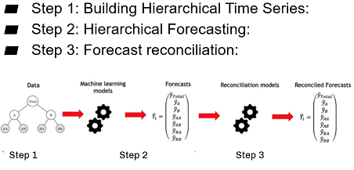
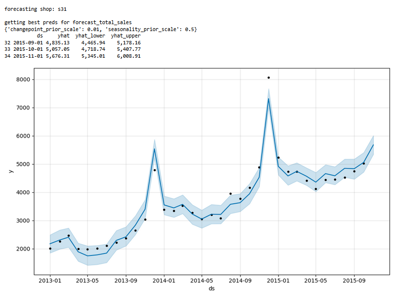
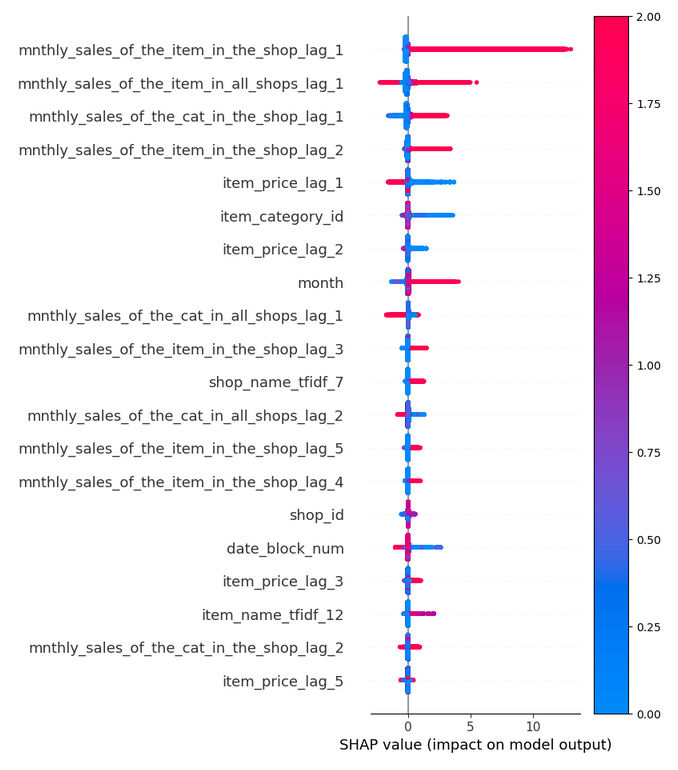

# Project-Predict-Future-Sales
    

 - [Goals](#Goals)
 - [Data Sources](#Data-Sources)
 - [Executive Summary](#Executive-Summary)
 - [Conclusion](#Conclusion)
 - [Future Improvements](#future-improvements)
 - [Notebook Contents](#Notebook-Contents)
 

# Goals
we aim to build robust models to forecast monthly sales for each product in each retail store of 1C company, provided that most historical sales data are intermittent and sparse

--- 
## Data Sources
The sources of the data will be from [Kaggle Competition: Predict Future Sales](https://www.kaggle.com/competitions/competitive-data-science-predict-future-sales/data).
Since the original dataset are in russian, I translated them into english for better comprehension

File descriptions

    sales_train.csv - the training set. Daily historical data from January 2013 to October 2015.
    test.csv - the test set. You need to forecast the sales for these shops and products for November 2015.
    sample_submission.csv - a sample submission file in the correct format.
    items.csv - supplemental information about the items/products.
    items_en.csv - English version of "items.csv"
    item_categories.csv  - supplemental information about the items categories.
    item_categories_en.csv - English version of "item_categories.csv"
    shops.csv- supplemental information about the shops.
    shops_en.csv - English version of "shops.csv"

Data fields

    ID - an Id that represents a (Shop, Item) tuple within the test set
    shop_id - unique identifier of a shop
    item_id - unique identifier of a product
    item_category_id - unique identifier of item category
    item_cnt_day - number of products sold. You are predicting a monthly amount of this measure
    item_price - current price of an item
    date - date in format dd/mm/yyyy
    date_block_num - a consecutive month number, used for convenience. January 2013 is 0, February 2013 is 1,..., October 2015 is 33
    item_name - name of item
    shop_name - name of shop
    item_category_name - name of item category

---
# Executive Summary
**Introduction**

The Dataset invloves 60 shops, 84 product categories and 22,170 products. Most products only have occasional transactions. The data are very intermittent and sparse, without clearly defined trend and any seasonal behavior. It is very difficult for a conventional time series model such as ARIMA to forecast.

# Methodology

**Hierarchical Time Series Forecasting & Reconciliation**

To handle such intermittent and sparse data, we adopted an approach called Hierarchical Time Series Forecasting & Reconciliation. 

It has the following steps:
- Building Hierarchical Time Series
- Hierarchical Forecasting
- Forecast reconciliation

# Implementation
**Building Hierarchical Time Series**

We used scikit-hts to build hierarchical time series from dataset.
Due to memory constraints, we can only build hierarchical time series up to individual store level

**Top Levels Modeling**

Time Series at top levels have noticeable trends and seasonality. We built time series models on each time series using Facebook Prophet. 
- we took yearly_seasonality and holidays into consideration when modeling
- we tuned 2 hyperparameters:
    - changepoint_prior_scale
    - seasonality_priro_scale

**Bottom level modeling**

Since data at bottom level are intermittent and sparse, we used ordinary regression models to predict:
- LightGBM
- XGBRegressor
- StackingRegressor, stacking the first two regressors

we refer the following kernels for Feature Engineering.
- [Predict Future Sales Top 11 Solution](https://www.kaggle.com/code/szhou42/predict-future-sales-top-11-solution/notebook)
- [Future Sales XGBoost - top 3%](https://www.kaggle.com/code/gordotron85/future-sales-xgboost-top-3/notebook)
- [Feature engineering, LightGBM - Top 1%](https://www.kaggle.com/code/uladzimirkapeika/feature-engineering-lightgbm-top-1/notebook)

**model evaluation**
| Models                    | RMSE_Train | RMSE_Test | Generalization | RMSE_kaggle_submission | 
|---------------------------|--------------|-------------|----------------|----------|
| LightGBM            | 1.08         | 0.93        | 14.38%           | 0.94     | 
| XGBRegressor | 0.97       | 0.94        | 3.1%           | 0.96     | 
| StackingRegressor  | 0.99         | 0.92       | 7.17%           | 0.95    | 

**Shap Values**

**Forecast reconciliation**

We used scikit-hts to reconcile the forecasts at top levels and prediction at bottom level to ensure they are coherent and sum up correctly in the heirachy.

The image below [(by Jiahao Weng)](https://medium.com/towards-data-science/optimal-forecast-reconciliation-for-hierarchical-time-series-ea892ca105a9)  shows the matrix notation of reconciliation equation: 

 $$\huge \tilde{y} = SP\hat{y}$$

In his [online textbook](https://otexts.com/fpp3/reconciliation.html), Prof. Hyndman found that forecasts are optimally reconciled (minimised error variances of the coherent forecasts)
when $\small P = (S^{T}W^{-1}S)^{-1}S^{T}W^{-1}$,
where W is the variance-covariance matrix of the corresponding base forecast errors.
$$\huge \tilde{y} = SP\hat{y}$$  
$$\huge     = S(S^{T}W^{-1}S)^{-1}S^{T}W^{-1}\hat{y}$$
Since W is difficult or expensive to obtain, Prof. Hyndman proposed several simplifying approximations that have been shown to work well in both simulations and in practice.  

\begin{equation}
  x = a_0 + \cfrac{1}{a_1 
          + \cfrac{1}{a_2 
          + \cfrac{1}{a_3 + \cfrac{1}{a_4} } } }
\end{equation}

We tried 3 such simplified reconciliaton strategies provided by scikit-hts:
- OLS : Ordinary least squares
    - where $\small P$ is simplified to  $\small (S^{T}S)^{-1}S^{T} $
- WLSS : Structurally weighted least squares
    - where $\small W$ is simplifed to $diag(S1)$, and $1$ is a unit vector of dimension m (the number of bottom-level series), thus $\small P = (S^{T}(diag(S1))^{-1}S)^{-1}S^{T}(diag(S1))^{-1}$
- WLSV : Variance-weighted least squares
    - where $\small W$ is simplifed to  $\small diag(\hat{W}), \hat{W}=\frac{1}{T}\sum_{t=1}^{T} e_{t}(e_{t})^{T}$,  $e$ is an n-dimensional vector of residuals of the models that generated the base forecasts stacked in the same order as the data

For the details of these 3 strategies, please refer to Prof. Hyndman's [online textbook](https://otexts.com/fpp3/reconciliation.html).

## Reconciliation Strategies Performance and analysis

- OLS strategy produced many negative results. It made the coherent prediction worse
    - OLS assumes that all time series in all level have similar error variance.
    - Our datasets obviously violated the assumption
- WLSS strategy produced better results in overall
    - WLSS assumes that all time series in same leve have similar error variance and 
- We encountered some errors when running WLSV strategy
- The Improvement of reconciliation is not encouraging 
- Possible reasons:
    - Due to memory constraints, we just built hierarchical time series up to one store, which may not able to reflect macro trends or seasonalities
    - Limited hyperparameter tuning 
    - Many products/categories have too limited sales transactions 
    - Many state-of-the-art reconciliation strategies have not supported by Scikit-hts 
        - MinTSample
        - MinTShrink

---
# Conclusion 
- Hierarchical Forecasting & Reconciliation did improve the overall prediction of intermittent time series with correct reconciliation strategy 
- Hierarchical Forecasting & Reconciliation can apply to any time series with a hierarchy structure
- Scikit-hts offers a lot of flexibilities 
    - Assist to build hierarchical time series from bottom level data
    - We can choose different ML algorithms for different levels of hierarchical time series
    - 3 reconciliation strategies are available at this moment.

# Future Improvements
- To build a bigger hierarchical to contain all data
- To try different reconciliation strategies:
    - Variance Scaling
    - MinTSample 
    - MinTShrink
- To try different time series models:
    - LSTM
    - N-BEATS
- More feature engineering for bottom level modelling  

# Notebook Contents
1. [01_data_cleaning_and_EDA] 
2. [02_building_hierarchical_time_series_and_top_level_forecastingure_engineering]
3. [03_bottom_level_feature_engineering_and_modelingmodelling]
4. [04_top_level_forecasts_and_bottom_level_predictions_reconciliationay_analysis]
---
